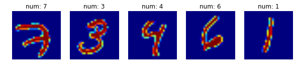
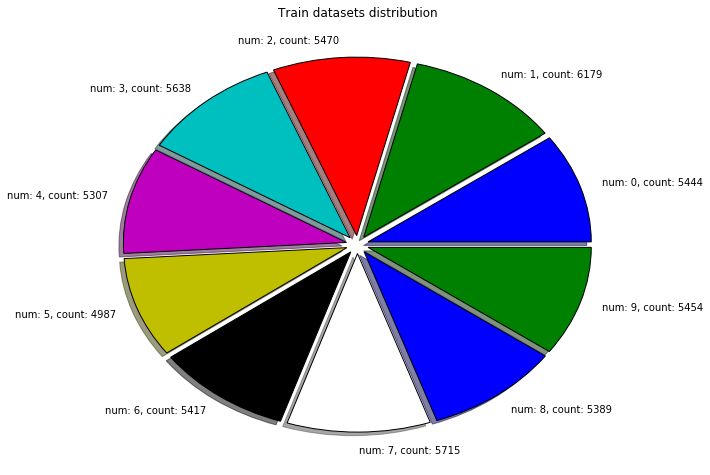
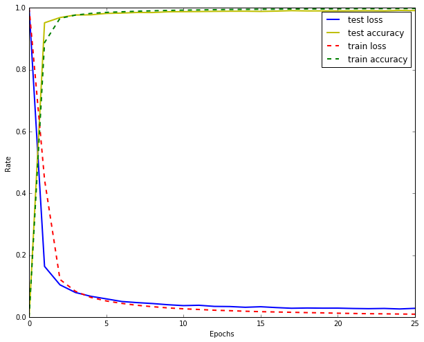

```python
%matplotlib inline
import matplotlib.pyplot as plt
import tensorflow as tf
import numpy as np
```


```python
# Lock seed
tf.set_random_seed(1)
np.random.seed(1)
```


```python
# Load datasets
from tensorflow.examples.tutorials.mnist import input_data
mnist = input_data.read_data_sets('.', one_hot=True)
```

    Extracting ./train-images-idx3-ubyte.gz
    Extracting ./train-labels-idx1-ubyte.gz
    Extracting ./t10k-images-idx3-ubyte.gz
    Extracting ./t10k-labels-idx1-ubyte.gz


```python
plt.figure(figsize=(10, 2))
for i in range(5):
    plt.subplot(151 + i)
    plt.title('num: {}'.format(np.argmax(mnist.train.labels[i])))
    plt.axis('off')
    plt.imshow((mnist.train.images[i].reshape(28, 28) * 255))
plt.show()
```





```python
num_label_list = [np.sum(np.argmax(mnist.train.labels, 1) == num) for num in range(10)]
num_labels = ['num: {}, count: {}'.format(num, num_label_list[num]) for num in range(10)]
plt.figure(figsize=(10, 8))
plt.title('Train datasets distribution')
plt.pie(num_label_list, explode=np.ones((10, )) * 0.05, labels=num_labels, shadow=True)
plt.show()
```





```python
# Config Model.

learning_rate = 1.
batch_size = 128
n_epochs = 25

input_dim = 784
n_classes = 10
dropout_rate = 0.75 # keep prob
```


```python
# Init placeholds.

X = tf.placeholder('float32', shape=(None, input_dim))
Y = tf.placeholder('float32', shape=(None, n_classes))
keep_prob = tf.placeholder('float32')
```


```python
# Define functions.

def conv2d(X, W, b):
    conv = tf.nn.conv2d(X, W, strides=(1, 1, 1, 1), padding='VALID')
    return tf.nn.bias_add(conv, b)

def maxpool2d(X, k=2):
    pool = tf.nn.max_pool(X, ksize=(1, k, k, 1), strides=(1, k, k, 1), padding='SAME')
    return tf.nn.relu(pool)
```


```python
# Define CNN

def CNN(X, Weights, biases, dropout):
    X = tf.reshape(X, shape=(-1, 28, 28, 1))
    
    conv1 = conv2d(X, Weights['W1'], biases['b1'])
    conv1 = maxpool2d(conv1)
    
    conv2 = conv2d(conv1, Weights['W2'], biases['b2'])
    conv2 = maxpool2d(conv2)
    
    fc1 = tf.reshape(conv2, shape=(-1, Weights['W3'].get_shape().as_list()[0]))
    fc1 = tf.add(tf.matmul(fc1, Weights['W3']), biases['b3'])
    fc1 = tf.nn.relu(fc1)
    
    fc1 = tf.nn.dropout(fc1, dropout)
    
    out = tf.add(tf.matmul(fc1, Weights['W4']), biases['b4'])
    
    return out
```


```python
# Init Weights, biases
Weights = {
    'W1': tf.Variable(tf.random_normal((5, 5, 1, 10), stddev=0.1)),
    'W2': tf.Variable(tf.random_normal((5, 5, 10, 20), stddev=0.1)),
    'W3': tf.Variable(tf.random_normal((320, 128), stddev=0.1)),
    'W4': tf.Variable(tf.random_normal((128, n_classes), stddev=0.1))
}

biases = {
    'b1': tf.Variable(tf.constant(0.1, dtype='float32', shape=(10, ))),
    'b2': tf.Variable(tf.constant(0.1, dtype='float32', shape=(20, ))),
    'b3': tf.Variable(tf.constant(0.1, dtype='float32', shape=(128, ))),
    'b4': tf.Variable(tf.constant(0.1, dtype='float32', shape=(10, )))
}
```


```python
# Define optimizer
pred = CNN(X, Weights, biases, keep_prob)
cost = tf.reduce_mean(tf.nn.softmax_cross_entropy_with_logits(logits=pred, labels=Y))
optimizer = tf.train.AdadeltaOptimizer(learning_rate=learning_rate).minimize(cost)
```


```python
# Evaluate model
currect_pred = tf.equal(tf.argmax(pred, 1), tf.argmax(Y, 1))
accuracy = tf.reduce_mean(tf.cast(currect_pred, 'float32'))
```


```python
train_loss_list = [1]
train_acc_list = [0]
test_loss_list = [1]
test_acc_list = [0]

init = tf.global_variables_initializer()
```


```python
with tf.Session() as sess:
    sess.run(init)

    for epoch in range(n_epochs):
        train_loss, train_acc = 0., 0.
        times = mnist.train.num_examples // batch_size
        for time in range(times):
            batch_X, batch_Y = mnist.train.next_batch(batch_size)
            sess.run(
                optimizer,
                feed_dict={X: batch_X, Y: batch_Y, keep_prob: dropout_rate})
            _loss, _acc = sess.run(
                [cost, accuracy],
                feed_dict={X: batch_X, Y: batch_Y, keep_prob: 1.})
            train_loss += _loss / times
            train_acc += _acc / times
        
        test_loss, test_acc = 0., 0.
        times = mnist.test.num_examples // 100
        for time in range(times):
            batch_X, batch_Y = mnist.test.next_batch(100)
            _loss, _acc = sess.run(
                [cost, accuracy],
                feed_dict={X: batch_X, Y: batch_Y, keep_prob: 1.})
            test_loss += _loss / times
            test_acc += _acc / times

        train_loss_list.append(train_loss)
        train_acc_list.append(train_acc)
        test_loss_list.append(test_loss)
        test_acc_list.append(test_acc)
        print('Epoch:', epoch + 1)
        print('train loss = {}, train accracy = {}'.format(train_loss, train_acc))
        print('test loss = {}, test accracy = {}'.format(test_loss, test_acc))
        print('-' * 64)
    plt.figure(figsize=(10, 8))
    plt.xlabel('Epochs')
    plt.ylabel('Rate')
    plt.plot(test_loss_list, '-b', label='test loss', linewidth=2)
    plt.plot(test_acc_list, '-y', label='test accuracy', linewidth=2)
    plt.plot(train_loss_list, '--r', label='train loss', linewidth=2)
    plt.plot(train_acc_list, '--g', label='train accuracy', linewidth=2)
    plt.legend()
    plt.show()
```

    Epoch: 1
    train loss = 0.4443066738597995, train accracy = 0.887765879953381
    test loss = 0.16357928668614477, test accracy = 0.9518000072240832
    ----------------------------------------------------------------
    Epoch: 2
    train loss = 0.12120290239513064, train accracy = 0.9663097319347327
    test loss = 0.10386718939989802, test accracy = 0.9687000060081483
    ----------------------------------------------------------------
    Epoch: 3
    train loss = 0.08308454673294423, train accracy = 0.9767081876456871
    test loss = 0.07907585117965932, test accracy = 0.9770000082254412
    ----------------------------------------------------------------
    Epoch: 4
    train loss = 0.0632455692363855, train accracy = 0.9821168414918408
    test loss = 0.06677781287580728, test accracy = 0.9776000100374226
    ----------------------------------------------------------------
    Epoch: 5
    train loss = 0.05172840568686382, train accracy = 0.9854676573426578
    test loss = 0.05846328499726952, test accracy = 0.9821000099182132
    ----------------------------------------------------------------
    Epoch: 6
    train loss = 0.04387511700578468, train accracy = 0.9873433857808871
    test loss = 0.04998355677351354, test accracy = 0.9833000105619432
    ----------------------------------------------------------------
    Epoch: 7
    train loss = 0.03767907215469022, train accracy = 0.9892191142191158
    test loss = 0.04636791503988204, test accracy = 0.9852000093460082
    ----------------------------------------------------------------
    Epoch: 8
    train loss = 0.03314874537011266, train accracy = 0.9906942016317035
    test loss = 0.043347653332166385, test accracy = 0.9850000089406966
    ----------------------------------------------------------------
    Epoch: 9
    train loss = 0.02920212241276091, train accracy = 0.9918961247086272
    test loss = 0.03946977616753429, test accracy = 0.9874000090360641
    ----------------------------------------------------------------
    Epoch: 10
    train loss = 0.026336590803959902, train accracy = 0.9928066724941761
    test loss = 0.03661633624695243, test accracy = 0.987800011634827
    ----------------------------------------------------------------
    Epoch: 11
    train loss = 0.024163109983050542, train accracy = 0.993425844988348
    test loss = 0.03778060481068677, test accracy = 0.988200010061264
    ----------------------------------------------------------------
    Epoch: 12
    train loss = 0.02175666237551727, train accracy = 0.9942453379953412
    test loss = 0.03413431243970991, test accracy = 0.988800008893013
    ----------------------------------------------------------------
    Epoch: 13
    train loss = 0.020249623997953218, train accracy = 0.9948827214452254
    test loss = 0.033665490971179685, test accracy = 0.9892000091075897
    ----------------------------------------------------------------
    Epoch: 14
    train loss = 0.018475939433545193, train accracy = 0.9951740967366002
    test loss = 0.031262051833327864, test accracy = 0.9893000090122227
    ----------------------------------------------------------------
    Epoch: 15
    train loss = 0.017045052730780098, train accracy = 0.995684003496507
    test loss = 0.03299126139376311, test accracy = 0.9886000096797949
    ----------------------------------------------------------------
    Epoch: 16
    train loss = 0.01602367654666392, train accracy = 0.995793269230773
    test loss = 0.03030299584730528, test accracy = 0.9896000099182131
    ----------------------------------------------------------------
    Epoch: 17
    train loss = 0.015029966716284463, train accracy = 0.9963031759906799
    test loss = 0.028130292522255324, test accracy = 0.9911000084877012
    ----------------------------------------------------------------
    Epoch: 18
    train loss = 0.013937192827100613, train accracy = 0.9966856060606099
    test loss = 0.02890130257350393, test accracy = 0.9902000081539153
    ----------------------------------------------------------------
    Epoch: 19
    train loss = 0.01320220576409286, train accracy = 0.996594551282055
    test loss = 0.028435585303232067, test accracy = 0.990300009250641
    ----------------------------------------------------------------
    Epoch: 20
    train loss = 0.012022299031669488, train accracy = 0.997159090909095
    test loss = 0.028514452622039246, test accracy = 0.9903000092506409
    ----------------------------------------------------------------
    Epoch: 21
    train loss = 0.011226750976495038, train accracy = 0.9974322552447599
    test loss = 0.027382605660241102, test accracy = 0.9907000070810319
    ----------------------------------------------------------------
    Epoch: 22
    train loss = 0.010432092313348622, train accracy = 0.9973958333333376
    test loss = 0.02675715623394353, test accracy = 0.9910000079870224
    ----------------------------------------------------------------
    Epoch: 23
    train loss = 0.010030447555345531, train accracy = 0.9977964743589784
    test loss = 0.0274913320451742, test accracy = 0.9905000072717667
    ----------------------------------------------------------------
    Epoch: 24
    train loss = 0.009408752404783997, train accracy = 0.9978693181818223
    test loss = 0.02583008143730695, test accracy = 0.9920000070333483
    ----------------------------------------------------------------
    Epoch: 25
    train loss = 0.008926902358047889, train accracy = 0.998160693473198
    test loss = 0.027891292339481885, test accracy = 0.9913000082969667
    ----------------------------------------------------------------




